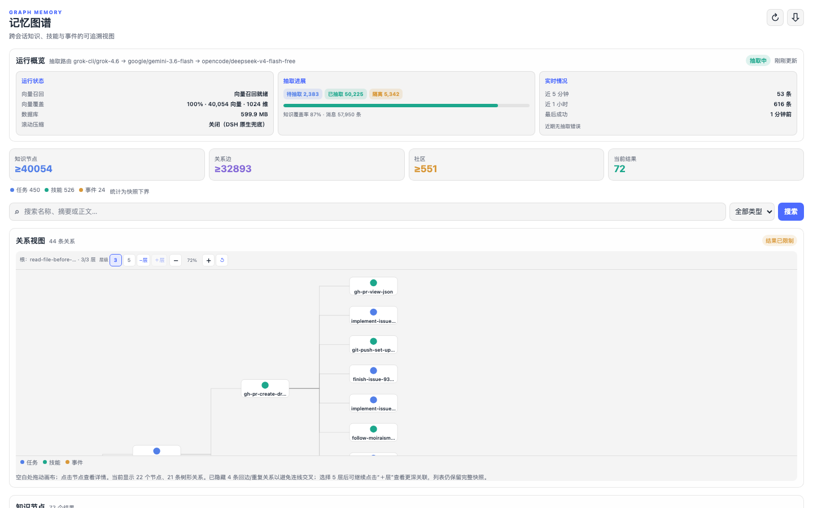
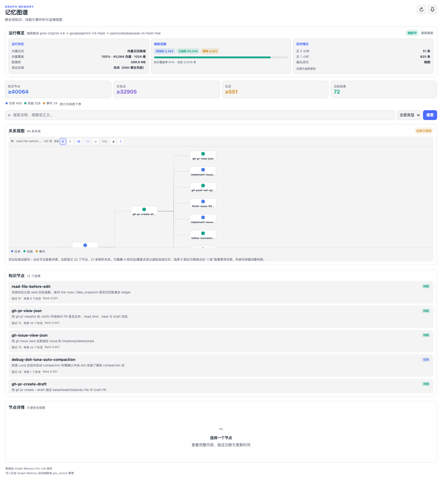

<div align="center">

# ⌁ dsh-graphmemory · 记忆图谱

**给 [DeepSeek Harness](https://github.com/deepseek-ai) 的跨会话知识图谱记忆：** 对话沉淀成任务 / 技能 / 事件，新问题召回相关子图，而不是整段重放历史。侧边栏页签 + 独立看板都能看抽取进度和关系图。

[](https://github.com/topics/dsh-plugin)
[](https://github.com/topics/dsh-better-sidebar)
[](https://www.npmjs.com/package/dsh-graphmemory)
[](./LICENSE)


*压缩管「这段对话还塞得下吗」；记忆图谱管「过去哪段知识现在值得想起来」。*

**0.2.x** 页签优先注册 DSH 官方原生右侧栏。

</div>

## ⭐ 欢迎点星收藏

如果 Graph Memory 帮到了你，欢迎到 [GitHub 仓库](https://github.com/meyaomiao/dsh-graphmemory) 点个 Star ⭐，让更多 DSH 用户看到它。问题与建议请提 Issue。

## 📋 兼容性

| 插件版本 | 状态 | 对应 DSH |
|---|---|---|
| **0.2.x**（当前主线，含 0.2.0） | ✅ | **0.1.5-rc.1 / 0.1.5-rc.2**（及之后的 0.1.5 线；页签走官方原生右侧栏） |
| 0.1.x | 🔧 维护态（仅修 bug） | DSH 0.1.2 线（`Session.events` 与 `snapshotEvents()` / `eventAt()` 双读） |

### 本次升级功能变化

- **页签宿主迁移**：DSH 0.1.5+ 优先注册官方原生右侧栏（`ctx.sidebarRightTabs`），better-sidebar 降为旧宿主回退；独立看板 `/graph-memory/app` 不变。
- **官方已有的交给官方**：不画赞踩、不画交付文件卡。抽取 / 召回 / 看板新旧两线都在。
- 会话 V3：ingest 白名单对 V3 事件形态前向安全；`snapshotEvents` / `eventAt` 双读继续有效。
- 「实时情况」长错误句裁在卡片内，不再撑破网格。

---

## ✨ 截图速览

| 运行概览：抽取路由 / 向量召回 / 队列 | 关系视图 + 知识节点列表 |
|---|---|
|  |  |

装了 [dsh-better-sidebar](https://github.com/omdsh-dev/DSH-better-sidebar) 时，同一套界面注册为侧边栏 **「⌁记忆图谱」** 页签；没装也能打开独立页 `http://127.0.0.1:<port>/graph-memory/app`。

## 🚀 核心能力

- **跨会话记忆**：Session A 抽出来的节点，Session B 能自动召回。数据在本机 SQLite，重启不丢。
- **三类节点**：`TASK`（目标与结果）· `SKILL`（可复用做法）· `EVENT`（事实、偏好、报错与修复）
- **五类边**：`USED_SKILL` · `SOLVED_BY` · `REQUIRES` · `PATCHES` · `CONFLICTS_WITH`
- **后台抽取**：对话事件入队后由配置的 LLM 路由抽取；截断 JSON 会抢救已完整的节点，而不是整批丢掉
- **双路召回**：向量（可选）+ FTS5；社区扩展与 PageRank；自动注入有分数门槛，显式 `gm_search` 更宽
- **看板**：运行状态、抽取进展、近 1 小时错误、分层关系图、搜索与节点详情
- **工具**：`gm_status` · `gm_search` · `gm_record` · `gm_stats` · `gm_maintain` · `gm_retry_extraction`
- **滚动压缩可选**：默认可由 profile 关掉，交给 DSH 原生压缩；图谱原文仍留在库里

召回进提示词的内容标成**不可信参考材料**，不能压过当前用户指令。

## 📦 安装

包名 **`dsh-graphmemory`**，版本线从 **0.1.0** 起（与上游 npm `graph-memory` 不是同一个包）。

```bash
# 推荐：npm
npx @deepseek-ai/dsh plugin --profile web add dsh-graphmemory

# 或 GitHub
npx @deepseek-ai/dsh plugin --profile web add github:meyaomiao/dsh-graphmemory

# 然后重启 dsh web，浏览器硬刷新
```

装完在 **设置 → 插件** 里确认 `dsh-graphmemory` 已启用。默认库：

```text
~/.dsh/graph-memory/graph-memory.db
```

### 抽取模型

在 profile 的 `cordis.patch.yml` 里给本插件配 `llmProvider` / `llmModel`，可选 `llmFallbacks`。会话当前选中的模型**不会**被抽取使用。

### 向量召回（可选）

不配也能跑，自动降级 FTS5。本机 Ollama 示例：

```yaml
embedding:
  baseURL: http://127.0.0.1:11434/v1
  model: bge-m3
```

密钥不要写进聊天。DSH 只存凭据引用。

## 🖥 看板

| 入口 | 说明 |
|---|---|
| 侧边栏页签「记忆图谱」 | DSH 0.1.5+ 走官方原生右侧栏；旧宿主可回退 better-sidebar |
| `/graph-memory/app` | 不依赖侧边栏；loopback + GET |
| `/graph-memory/api/*` | 只读 JSON：status / snapshot / stats / node |

概览三块：**运行状态**（向量、库大小、滚动压缩开关）· **抽取进展**（待抽 / 已抽 / 隔离）· **实时情况**（近 5 分钟 / 1 小时成功数，以及近 1 小时错误）。

## 🧩 给插件开发者

- Host 入口 `dsh.ts`：`inject` 含 `webServer` 等；前缀 `/graph-memory`
- Client 入口 `dashboard/client.ts`：`package.json dsh.client.inject` 为 `slots`（0.1.5 官方栏）；旧宿主 better-sidebar 走 try/catch 回退
- 非 scoped 包的 patch `name` 必须是包根 `dsh-graphmemory`，不能写成 `dsh-graphmemory/dsh`（否则 client 被静默跳过）
- OpenClaw 仍走 `exports["./openclaw"]` → `dist/index.js`

## 🛠 开发

```bash
npm install
npm test              # vitest
npm run build:dsh     # host dist/dsh.js
npm run build:client  # dist/client.js + dist/standalone.js
```

上游谱系：[adoresever/graph-memory](https://github.com/adoresever/graph-memory)。本仓是独立维护的 DSH 发行线。

## License

[MIT](./LICENSE)
