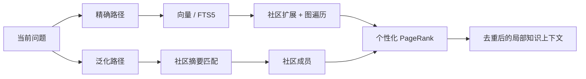
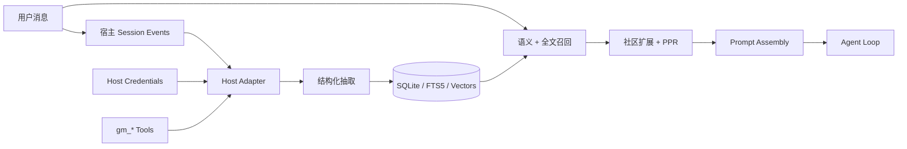
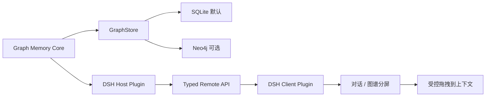

# Graph Memory


<p align="center">
  <strong>为 AI Agent 提供可检索、可追溯、跨会话的长期记忆</strong><br>
  一个宿主无关的图记忆内核，原生接入 DeepSeek Harness，并继续兼容 OpenClaw。
</p>

<p align="center">
  <a href="https://www.dsh.so/zh/artifact/graph-memory"></a>
  <a href="https://www.dsh.so/zh/artifact/graph-memory"></a>
</p>

<p align="center">
  <a href="README.md">English</a> ·
  <a href="#核心优势">核心优势</a> ·
  <a href="#图记忆架构">图架构</a> ·
  <a href="#安装到-deepseek-harness">DSH 安装</a> ·
  <a href="#graph-memory-pro如何作为-dsh-插件集成">Pro 插件</a> ·
  <a href="docs/DSH_NATIVE_PLAN.md">技术报告</a>
</p>

Graph Memory 不是聊天记录归档器，也不是把所有历史重新塞回上下文。它把对话中的任务、技能、事件和因果关系沉淀为类型化知识图谱，在新问题出现时只召回相关的局部子图。

## 核心优势

### 一套内核，两个原生宿主入口

- **DeepSeek Harness**：通过 Cordis 生命周期接入 Session、Tool、Agent Loop、Prompt Assembly、LLM 与 Credentials；不修改 DSH 核心源码。
- **OpenClaw**：保留原有 Context Engine 插件入口、配置方式和数据能力。
- **共享内核**：抽取、SQLite 存储、FTS5、向量检索、社区发现、PageRank 和上下文组装不绑定单一宿主。

### 把历史变成可复用知识

- 跨 Session 召回，宿主重启后仍然保留。
- `TASK`、`SKILL`、`EVENT` 三类节点表达目标、方法、结果、错误与决策。
- `USED_SKILL`、`SOLVED_BY`、`REQUIRES`、`PATCHES`、`CONFLICTS_WITH` 五类关系保留因果和依赖。
- 节点关联原始会话证据，能够解释“这条记忆从哪里来、为什么被召回”。

### 只把相关知识送进上下文

- 默认原样保留最近 5 个真实用户轮次，可通过 `freshTurnCount` 配置。
- 通过每个 Agent 的 DSH 公共 CompactionEngine，把更早的模型表面历史替换为滚动 checkpoint；持久化原始事件不删除。
- checkpoint、知识节点与精确原消息来源建立关联，召回时可以回溯原文。
- 精确路径：向量 / FTS5 → 社区扩展 → 图遍历 → 个性化 PageRank。
- 泛化路径：查询向量 → 社区摘要 → 社区成员 → 图排序。
- 只注入与本轮问题相关的跨会话局部图，并受 `recallTokenBudget`（默认 4096）约束。
- 自动注入使用高精度语义门槛（`autoRecallMinScore`，默认 0.6），且不会在无关查询下退化为任意社区代表节点；显式 `gm_search` 仍保留宽召回。
- 召回内容被标记为不可信参考材料，不能覆盖当前用户指令。

### 本地优先，向量能力可选

- Community 默认使用 SQLite，无需部署独立图数据库。
- 未配置 Embedding 时自动使用 FTS5，不阻断对话。
- 支持 OpenAI-compatible Embedding 接口，可接 DashScope、OpenAI 或本地服务。
- `gm_status` 显示数据库、节点、边、检索模式、向量覆盖率和维度。

### 限定场景下的 Token 实测

旧版 OpenClaw 入口曾在“安装 bilibili-mcp → 登录 → 查询”的 7 轮连续任务中进行对照测试：

<p align="center">
  
</p>

| 轮次 | 无 Graph Memory | 有 Graph Memory |
|---|---:|---:|
| R1 | 14,957 | 14,957 |
| R4 | 81,632 | 29,175 |
| R7 | **95,187** | **23,977** |

该场景第 7 轮减少约 **75%** Token。它是一个特定工作流的对照结果，不代表所有任务都有固定压缩比例；核心机制是用相关知识子图替代无差别历史回放。

## 项目发展

Graph Memory 的方向没有因为新宿主而推倒重来。项目正在从“OpenClaw 上的记忆插件”，发展为“可被不同 Agent Harness 原生加载的图记忆内核”。

| 阶段 | 交付内容 | 状态 |
|---|---|---|
| OpenClaw 起点 | Context Engine、跨会话图记忆、双路径召回 | 保持兼容 |
| Community 图引擎 | SQLite、FTS5、向量、图排序、溯源 | 可使用 |
| DeepSeek Harness | Cordis 适配器、原生工具、自动召回、Credentials | 已完成并实测 |
| Graph Memory Pro | 可视化图工作台、受控拖拽、Neo4j 可选适配器 | Pro Lite 只读 Host + Client 已实现；2D/3D 与拖拽待实现 |

2026 年 3 月 15 日，项目负责人在清华科技园举办的 CLAW 蜕壳计划活动中分享了 Graph Memory 的架构思路。以下为项目负责人提供的现场材料与[新浪财经活动报道](https://cj.sina.com.cn/articles/view/7984421895/1dbe89c0700101nnpq)。

<p align="center">
  
  
</p>

- [开源版跨会话记忆演示](https://www.bilibili.com/video/BV1xUcZzfEaB/)
- [Graph Memory Pro 技术分享](https://www.bilibili.com/video/BV1KwwzzGEvD/)

下图是既有 OpenClaw / ClawX 阶段的 Pro 图谱原型，用于说明已经验证过的图交互方向；它不是当前 DSH 版本已经交付的前端。

<p align="center">
  
</p>

相关名称与现场信息仅用于项目履历记录，不表示清华大学、新浪财经、DeepSeek 或 OpenClaw 对本项目提供官方背书。

## 图记忆架构

### 类型化知识图谱

```text
TASK   ──USED_SKILL──▶ SKILL
TASK   ──SOLVED_BY───▶ EVENT
SKILL  ──REQUIRES────▶ SKILL
EVENT  ──PATCHES─────▶ SKILL
SKILL  ──CONFLICTS_WITH──▶ SKILL
```

- **TASK**：做过什么，包含目标、过程和结果。
- **SKILL**：经过验证、可以复用的方法或能力。
- **EVENT**：错误、修复、决策、变化和关键事实。
- **Episodic provenance**：图节点关联原始 user / assistant 片段，保留形成知识时的语境。

### 双路径召回



同一张图会根据当前问题产生不同排名。查询 Docker 时，Docker 相关技能靠前；查询 Conda 时，环境管理相关技能靠前。对几千节点规模的图，图排序可以在本地完成。

### 宿主数据流



```text
graph-memory/
├── dsh.ts                 # DeepSeek Harness / Cordis 适配器
├── index.ts               # OpenClaw 适配器
├── cordis.patch.yml       # DSH Bundle 安装入口
└── src/
    ├── extractor/         # 对话 → TASK / SKILL / EVENT
    ├── recaller/          # 向量、FTS5、社区扩展与召回
    ├── graph/             # PageRank、社区检测、去重
    ├── store/             # SQLite schema 与查询
    ├── format/            # 安全上下文组装
    └── engine/            # LLM / Embedding provider
```

## DeepSeek Harness 原生适配状态

| 能力 | 状态 | 说明 |
|---|---|---|
| Cordis 原生加载 | **已完成** | 使用插件生命周期，无需 fork DSH |
| 滚动上下文接管 | **已完成** | 最近 N 轮可配置，更早表面历史替换为 checkpoint |
| 跨会话自动召回 | **已完成** | 在 Prompt Assembly 阶段注入相关记忆 |
| 显式记录与搜索 | **已完成** | `gm_record`、`gm_search` |
| 向量回填与模型迁移 | **已完成** | 追踪模型、维度与 fingerprint |
| 插件状态可见 | **已完成** | 设置页 Plugin Inventory 显示 active |
| Pro 可视化工作台 | **实验版可用** | 独立 DSH Client Plugin，当前为只读卡片式快照 |

当前 beta：`1.6.0-beta.12`。完整功能验收宿主为 DeepSeek Harness `0.1.0-rc.8`；随后又在 `0.1.1-rc.2` 上复验了无脚本 Git 安装与 profile 配置组合。重启回填与滚动压缩同时兼容 `Session.events`（0.1.1）和 `snapshotEvents()` / `eventAt()`（0.1.2-rc.1），避免 0.1.2 去掉 `events` 数组后静默跳过摄取。验收已覆盖无安装脚本的 Git 与 tarball 安装、Web / Headless profile 原生加载、通过 Agent 公共 compaction 服务执行的可配置最近 5 轮滚动压缩、精确原文溯源、无损有界抽取队列、失败隔离与恢复、有界原始消息保留策略、token 预算、高精度自动召回、FTS5 降级，以及 Pro Lite Host、Typed Remote 和 Client bundle 边界；155 项自动化测试通过。真实模型验收还完成了滚动 checkpoint 替换、`text-embedding-v4` 1024 维向量写入，以及不调用记忆工具的跨项目自动召回。

<p align="center">
  <strong>插件已启用：graph-memory/dsh 在 DSH 插件列表中处于 active</strong><br>
  
</p>

<p align="center">
  <strong>跨会话语义召回：新 Session 召回上一 Session 的知识</strong><br>
  
</p>

## 安装到 DeepSeek Harness

前置条件：Node.js `22.13+`。包名：`dsh-graphmemory`。

```bash
npx @deepseek-ai/dsh plugin --profile web add dsh-graphmemory
npx @deepseek-ai/dsh --profile web --dump-config
npx @deepseek-ai/dsh web
```

不走 npm、直接从 GitHub 装：

```bash
npx @deepseek-ai/dsh plugin --profile web add github:meyaomiao/dsh-graphmemory
```

也可以从 checkout 构建并安装 tarball：

```bash
git clone https://github.com/meyaomiao/dsh-graphmemory.git
cd dsh-graphmemory
npm install
npm test
npm pack
npx @deepseek-ai/dsh plugin --profile web add /absolute/path/to/dsh-graphmemory-1.6.0-beta.12.tgz
```

安装后，在 **设置 → 插件 → 插件列表 → dsh-graphmemory** 中确认状态为“已启用”。默认数据库路径：

```text
$DSH_HOME/graph-memory/graph-memory.db
# 未设置 DSH_HOME 时通常为：
~/.dsh/graph-memory/graph-memory.db
```

### 配置向量检索

不要把 API key 发送到聊天框。DSH 配置只保存凭据引用，真实密钥由 Credentials 服务解析。DashScope 示例：

```bash
export GRAPH_MEMORY_EMBEDDING_API_KEY='replace-with-your-key'
export GRAPH_MEMORY_EMBEDDING_BASE_URL='https://dashscope.aliyuncs.com/compatible-mode/v1'
export GRAPH_MEMORY_EMBEDDING_MODEL='text-embedding-v4'
export GRAPH_MEMORY_EMBEDDING_DIMENSIONS='1024'
dsh web
```

未配置 Embedding 时会自动使用 FTS5。

<p align="center">
  
</p>

### 原始消息保留策略（显式启用）

DSH 上下文压缩与 SQLite 数据保留是两件事：压缩只限制模型表面上下文，不会自动删除 `gm_messages` 中的溯源证据。默认策略是 `keep: all`，因此升级不会删除任何现有数据。

数据库较大时，可在 `graph-memory/dsh` 配置中加入 `messageRetention`。第一次必须先使用 dry-run：

```yaml
messageRetention:
  keep: referenced
  recentTurns: 20
  retentionDays: 30
  batchSize: 500
  dryRun: true
```

- `all`：保留全部持久事件，默认值。
- `referenced`：只清理已经抽取且没有 `gm_node_sources` 引用的消息；可叠加最近轮次/天数保护窗口。
- `recent`：必须配置 `recentTurns` 或 `retentionDays`；仍然无条件保护来源引用和待抽取消息。

`recentTurns` 按每个 Session 的真实用户轮次计算，并保留后续 assistant/tool 事件。两个窗口同时存在时，只有同时超出两个窗口的消息才有资格清理；时间戳异常的消息会保守保留。每次维护只执行一个有上限的事务，删除前再次检查来源引用，不会自动执行 `VACUUM`。

启用真实删除前，请备份 `$DSH_HOME/graph-memory/graph-memory.db`，保持 `dryRun: true`，调用一次 `gm_maintain` 并检查 `gm_stats` 回执；候选范围符合预期后再改为 `false`。

### DSH 原生工具

| 工具 | 作用 |
|---|---|
| `gm_status` | 查看插件、数据库、抽取、召回、向量和保留策略状态 |
| `gm_search` | 主动搜索长期知识图谱 |
| `gm_record` | 确定性记录 TASK、SKILL 或 EVENT |
| `gm_stats` | 查看图谱、原始消息和保留策略回执/统计 |
| `gm_maintain` | 执行一次有界图维护与已配置的消息保留批次 |
| `gm_retry_extraction` | 将隔离的抽取失败消息重新入队，不删除或截断原始对话 |

抽取队列默认按 8,000 个字符和 15 条消息限制单次临时投影。超长的单条消息会按语义边界分段抽取，SQLite 中的原始事件保持完整；连续失败的消息进入 `quarantined`，不会伪装成已抽取，也不会被消息保留策略删除。`gm_status` / `gm_stats` 会分别显示 pending、succeeded 和 quarantined 数量。参数统一位于 `extractionDrain`，默认值见 `cordis.patch.yml`。

自动召回不要求模型主动调用 `gm_search`；适配器会在 Prompt Assembly 阶段检索并注入相关记忆。

## Graph Memory Pro：如何作为 DSH 插件集成

### 结论

**旧 `desktop-2.0` Pro 不能直接安装到 DSH，但新的 Pro Lite 已经作为独立 DSH 插件实现最小可用闭环。** 旧分支是 OpenClaw + Neo4j 实现，绑定 `openclaw/plugin-sdk`、OpenClaw Gateway Route 和旧 ClawX 交互方向。新实现位于 `dsh-pro/`：Host 读取 Community SQLite，Typed Remote 只提供受限快照，Client 在 DSH Web 侧边栏注册只读入口。Neo4j、GDS、APOC 和旧 CRUD 后端仍可在后续作为可选适配器迁移。

目标不是再做一个独立产品，而是把 Pro 作为 Graph Memory 的可选增强插件：



### 推荐包结构

```text
dsh-graphmemory                      # Community：当前原生 Host Plugin
graph-memory-pro-dsh                # Pro Lite：Host + Client Plugin（本地 beta）
@adoresever/graph-memory-store-neo4j # 可选大图存储适配器（待实现）
```

第一版优先做 **Pro Lite**：继续读取现有 SQLite 图数据，只增加 DSH 图谱工作台。这样用户不需要安装 Neo4j。Neo4j 作为可选适配器，面向更大图谱、GDS 与复杂分析。**这是规划中的目标架构；现有 `desktop-2.0` Pro 仍是 Neo4j-only，尚未实现 SQLite / Neo4j 可切换的 `GraphStore`。**

### 当前本地安装方式

当前 npm 上的 `graph-memory@1.5.8` 仍是上游 OpenClaw 包。本 fork 以 `dsh-graphmemory` 发布。Pro Lite 仍从 checkout 安装：

```bash
dsh plugin --profile web add dsh-graphmemory

dsh plugin --profile web add \
  /absolute/path/to/graph-memory/dsh-pro

dsh web
```

两个插件默认共用 `~/.dsh/graph-memory/graph-memory.db`。当前入口提供受限 SQLite `GraphSnapshot`、`gm_graph_snapshot`、`gm_graph_node`、Typed Remote，以及侧边栏只读快照/搜索界面；尚无 2D/3D renderer、完整分屏、拖拽写入和节点编辑。

### 必须改造的四层

1. **Core contract**：SQLite `GraphSnapshot` 与受限节点详情已经落地；Neo4j provider 和统一可写契约待实现。
2. **Host Plugin**：Pro Lite Host、两个受限工具和只读 Typed Remote 已落地；可写动作与更细权限策略待实现。
3. **Client Plugin**：DSH 侧栏入口、卡片式快照、搜索与刷新已落地；2D/3D 图谱和对话分屏待实现。
4. **受控上下文操作**：拖拽只提交节点 ID 与动作意图；Host 校验后把内容写入可见、可撤销的 Session Context。

旧 Pro 的 `/graph-memory-pro/neo4j-config` 会把连接信息返回浏览器，这是已经在新实现中消除的安全问题。当前 Pro Lite 的浏览器只获取经过严格校验和裁剪的 `GraphSnapshot`，不会接收数据库路径、Session ID、Bolt 密码、SQL 或任意 Cypher。后续可写动作也必须保持这条 Host 权限边界。

## OpenClaw 兼容

OpenClaw 用户继续使用原入口：

```bash
openclaw plugins install graph-memory
openclaw plugins enable graph-memory
openclaw gateway restart
```

还必须在 `~/.openclaw/openclaw.json` 激活 Context Engine，否则插件可能显示已安装，但不会进入完整的消息摄取与抽取管线：

```json
{
  "plugins": {
    "slots": {
      "contextEngine": "graph-memory"
    },
    "entries": {
      "graph-memory": {
        "enabled": true
      }
    }
  }
}
```

现有 Context Engine 配置和数据能力继续保留。DSH 是新增的原生宿主入口，不要求 OpenClaw 用户迁移或放弃现有工作流。

## 开发与验证

```bash
npm install
npm test
npm run build
npm pack
```

发布前必须确认：测试与 TypeScript 构建通过；tarball 包含 `dist/dsh.js` 与 `cordis.patch.yml`；仓库不存在 API key、本地数据库和环境文件；文档不把 Pro 路线图写成已完成功能。

## 当前限制

- 自动抽取依赖辅助模型输出稳定性；关键知识在 beta 阶段建议使用 `gm_record`。
- DSH 版暂未提供 `gm_update`；`gm_maintain` 与 `gm_retry_extraction` 已作为原生工具提供。
- Pro Lite 目前只有只读卡片式 Client；2D/3D、分屏和受控拖拽尚未实现。
- npm registry 发布尚未完成，当前使用 GitHub 源码 tarball 安装。

## 隐私与安全

- 数据默认保存在本机 SQLite。
- API key 通过宿主凭据或环境变量注入，不写入数据库和 Cordis patch。
- 召回历史只作为参考；当前用户指令始终拥有更高优先级。
- 曾出现在聊天、日志或截图中的密钥应立即轮换。

## 许可证

[MIT](LICENSE) © 2026 adoresever

素材来源、Logo 与商标说明见 [docs/ATTRIBUTIONS.md](docs/ATTRIBUTIONS.md)。
