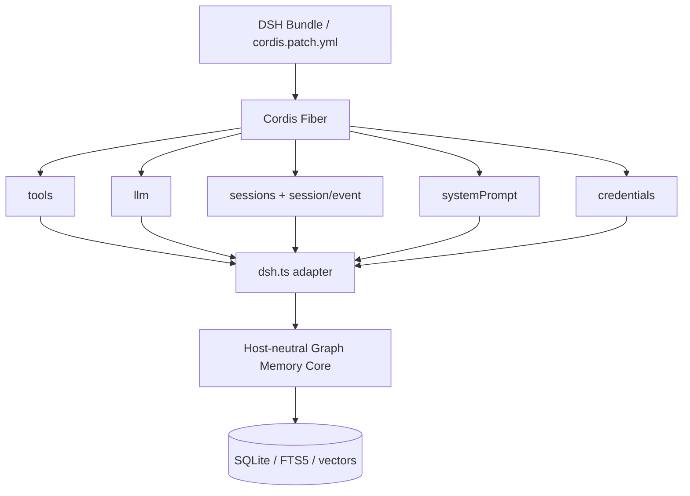
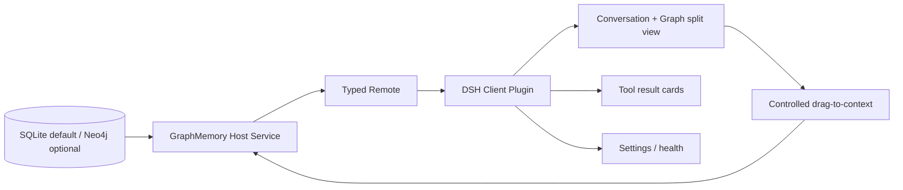

# Graph Memory × DeepSeek Harness 原生架构与 Pro 路线图

> 更新：2026-09-04
> Community 状态：`1.6.0-beta.12` 已完成 DSH 原生加载、滚动上下文接管、无安装脚本分发、可选原始消息保留策略与真实跨项目召回验证；重启回填/滚动压缩双读 `Session.events` 与 0.1.2 的 `snapshotEvents()` / `eventAt()`
> Pro 状态：SQLite GraphSnapshot、DSH Host、Typed Remote 与只读 Client 已实现；2D/3D、分屏和拖拽尚未实现

## 1. 结论

Graph Memory 可以在不修改 DeepSeek Harness 核心代码的前提下，作为 Cordis 原生插件安装、显示、运行和卸载。Community 版已经完成最小闭环：

- DSH bundle 与 `cordis.patch.yml` 可被 CLI 安装；
- Plugin Inventory 显示 `graph-memory/dsh` active；
- Session 事件幂等摄取，SQLite 跨会话持久化；
- `system-prompt/assemble` 自动注入召回结果；
- `gm_status`、`gm_search`、`gm_record`、`gm_stats`、`gm_maintain` 可用；
- FTS5 与 OpenAI-compatible embedding 双路径；
- DSH credentials 引用，不把 API key 放入 Cordis 配置；
- 旧节点启动时自动补向量，显式写入等待向量完成；
- OpenClaw 入口保留。

当前最重要的未完成项不是“能不能接入”，而是自动抽取稳定性、发布工程和 Pro 客户端工作台。

## 2. Everything is a plugin 对 Graph Memory 的意义

DSH 把模型路由、Agent Loop、Session、工具、Prompt Assembly、凭据和 Client UI 都暴露为 Cordis 服务或插件表面。Graph Memory 因而可以只依赖能力接口，不依赖宿主内部单例：



这就是插件灵活性的来源：依赖由宿主注入，生命周期由 fiber 管理，功能通过事件和服务组合。插件无需 fork DSH，也不需要通过 MCP 绕一圈。

## 3. 当前代码边界

```text
graph-memory/
├── dsh.ts                 # DSH/Cordis adapter
├── index.ts               # OpenClaw adapter
├── cordis.patch.yml       # DSH bundle patch
└── src/
    ├── extractor/         # structured extraction
    ├── recaller/          # vector/FTS recall and graph expansion
    ├── graph/             # PageRank, PPR, communities, dedup
    ├── store/             # SQLite schema and queries
    ├── format/            # safe prompt assembly
    └── engine/            # LLM and embedding providers
```

`src/` 是宿主无关核心，`dsh.ts` 和 `index.ts` 负责协议翻译。这个结构允许 Community 先发布；等 Pro 开发开始后再按真实复用压力拆成 workspace packages，当前不需要为了“看起来架构化”提前大搬家。

## 4. Community 数据流

### 写入链路

1. `session/event` 接收最终 user、assistant 和 tool result 事件。
2. 只保存不可变的 append 原事件；派生的 surface replacement 不重复入库。幂等键采用 `dsh:<sessionId>:<event.seq>`，resume/HMR 回放不会重复记录。
3. `turn/end` 串行调度该会话的结构化抽取。
4. 节点与边写入 SQLite，随后生成 embedding。
5. 抽取失败时消息仍为 pending，后续可以重试，不伪装成功。

### 上下文接管链路

1. `freshTurnCount` 只统计来源为真实用户的 `user/message`，默认保留最近 5 轮。
2. `agent/pre-step` 选择更早的完整 surface 前缀，不拆开工具调用/结果边界。
3. 插件从 agent 作用域取得 DSH 公共 `compaction` 服务并调用 `compactRegion`；不修改 DSH 源码。
4. DSH 原子写入 summary 与 replacement，原始事件仍在 durable log 中。
5. Graph Memory 把 summary 记录为稳定的 Session Capsule，并关联 `shadowedSeqs` 对应的精确原消息。
6. 当前 Session 不再自动重复注入自身图节点；跨 Session 召回受独立 token 预算约束。

### 召回链路

1. `agent/inbox/claimed` 取得当前用户问题。
2. 向量精确路径与社区泛化路径召回候选节点。
3. FTS5 在 embedding 未配置或失败时兜底。
4. 局部图遍历与 PPR 排序后限制节点数和深度。
5. `system-prompt/assemble` 注入带来源的历史参考。

Graph Memory 负责“何时压、保留几轮、压缩结果如何进入长期图记忆”；DSH CompactionEngine 负责安全的摘要生成、工具配对校验和 surface replacement 事务。两者是策略层与宿主执行层的组合，不是互不相干的两套系统。

### 持久消息保留链路

模型 surface 压缩不是删除 `gm_messages` 的授权。DSH adapter 的持久层默认 `messageRetention.keep=all`；只有用户显式选择 `referenced/recent` 才运行 GC。候选必须同时满足：已完成抽取、没有 `gm_node_sources` 引用、超出配置的用户轮次与天数窗口。候选选择和删除使用同一个 `BEGIN IMMEDIATE` 事务，DELETE 前再次检查引用，每个 tick 受 `batchSize` 限制。

dry-run 与真实删除返回相同结构的回执，包括候选/删除行数、估算内容字节、角色、Session 数、时间范围、是否还有下一批和配置 revision。`gm_status/gm_stats` 暴露有效策略和累计结果；`gm_maintain` 可手动执行一个维护 tick。`VACUUM` 不属于保留保证，必须作为独立管理操作。无效配置在打开数据库前报错，默认升级路径不会删除数据。

## 5. Embedding 与凭据设计

Cordis patch 只声明：

```yaml
embedding:
  apiKeyEnv: GRAPH_MEMORY_EMBEDDING_API_KEY
  baseURL: <environment value>
  model: <environment value>
  dimensions: <environment value>
```

运行时由 `ctx.credentials.resolve(ref)` 每次解析真实值。这带来三条安全性质：

- `--dump-config` 只能看到引用名，看不到密钥；
- 密钥轮换在下一次请求生效；
- 会话和 Graph Memory 数据库不需要保存凭据。

向量内容 hash 加入 `baseURL + model + dimensions` 指纹。配置变化会使旧向量失效并重新生成；搜索只比较维度完全一致的向量。启动后插件顺序回填所有 active 节点，`gm_status` 报告 `vector-ready`、向量覆盖率和实际维度。

## 6. 实测证据

| 验收项 | 结果 |
|---|---|
| DSH 原生加载 | Plugin Inventory active |
| 旧节点回填 | 15/15，1024 dimensions |
| 显式记录 | `gm_record` 返回前完成向量写入 |
| 跨会话语义召回 | 不同措辞、无显式 `gm_search` 仍命中 |
| 重启持久化 | 通过 |
| 无 embedding 降级 | FTS5，通过 |
| 单元/迁移/组合测试 | 139/139（含滚动压缩、溯源、消息保留、预算、高精度召回和 Pro Lite） |
| TypeScript build | 通过 |
| 真实模型滚动压缩 | DSH rc.8 上通过；第 6 个真实用户轮次触发最旧完整前缀替换 |
| 真实跨项目召回 | 新项目不调用 `gm_search`，自动召回并准确回答 |
| 真实向量写入 | `text-embedding-v4`，1024 dimensions |

证据截图位于 `docs/images/dsh/`。

## 7. Skills、MCP、Claude Code 兼容边界

| 扩展类型 | DSH 中的可用性 | Graph Memory 做法 |
|---|---|---|
| 标准 `SKILL.md` | 高，但路径/工具假设需检查 | 索引 Skill 元数据与使用关系，不自动执行历史文本 |
| MCP tool server | 工具桥接兼容 | 建模 Server、Tool 和调用关系，不存 token/secret |
| Claude Code hooks | 仅受支持事件的映射 | 不作为 Community 依赖 |
| Claude plugin/marketplace | 不能原封不动安装 | 重新封装为 DSH Bundle/Cordis plugin |
| Cordis plugin | DSH 原生 | Graph Memory 的主集成方式 |

Graph Memory 中的 `SKILL` 节点是经验知识，不等于可执行 `SKILL.md`。未来 `gm_promote_skill` 必须先生成候选、展示 diff、获得用户确认，再写入技能目录，避免把历史提示注入升级成代码执行。

## 8. Pro：DSH 分屏 3D 图谱

### 能否实现

可以。DSH Client Plugin 可以注册工作台入口、会话视图与工具卡片；Host 插件可以通过 typed remote 向浏览器提供受控图快照。实现不需要修改 DSH core。



### 拖拉拽的安全语义

浏览器不能把任意 HTML 或整段秘密内容偷偷塞进模型。拖拽 payload 仅包含：

```ts
interface MemoryDropPayload {
  nodeIds: string[]
  intent: 'reference' | 'compare' | 'apply-skill'
}
```

Host 收到后检查节点权限、状态、大小和类型，再生成可见的 context attachment，并写入 durable session event。用户能够看到、删除或撤销这次加载。

### 是否必须 Neo4j

不必须。建议存储抽象：

```ts
interface GraphStore {
  snapshot(input: SnapshotQuery): Promise<GraphSnapshot>
  node(id: string): Promise<GraphNodeDetail | null>
  neighbors(id: string, depth: 1 | 2): Promise<GraphSnapshot>
  stats(): Promise<GraphHealth>
}
```

- Community / Pro Lite 默认 SQLite：适合本地单用户和数千到数万节点，安装最轻。
- Pro 可选 Neo4j/GDS：适合超大图、多用户、复杂 Cypher 与图分析。
- 浏览器永远不直连 Neo4j，不接收 Bolt 密码，也不执行任意 Cypher。

### 视觉实现顺序

1. 先做 2D Canvas/WebGL 图谱：搜索、筛选、节点详情、邻居展开。
2. 再加入会话分屏和节点拖入上下文。
3. 性能与可访问性通过后，再提供 Three.js / force-graph 的 3D 模式。

3D 不是数据架构，它只是同一 `GraphSnapshot` 的第二种 renderer。这样即使低配机器关闭 3D，记忆能力也不受影响。

## 9. 三阶段计划表

| 阶段 | 目标 | 当前进度 | 完成标准 |
|---|---|---:|---|
| 第一步：Community 原生插件 | 可安装、可显示、跨会话记录/召回、向量检索、OpenClaw 保留 | 约 85%，beta 闭环完成 | 自动抽取 P0 修复、发布包/安装/卸载 E2E、文档与版本发布 |
| 第二步：Pro Lite 客户端 | SQLite 图快照、2D 图谱、分屏、受控拖拽、Skill/MCP 索引 | Host、Typed Remote、只读卡片 Client 已完成；2D/分屏/拖拽未开始 | 不改 DSH core；1 万节点交互性能达标；完整权限与审计 |
| 第三步：Pro 完整版 | 3D renderer、可选 Neo4j/GDS、迁移与大图能力 | 待开始 | SQLite/Neo4j 同契约；凭据零下发；多平台安装与回滚通过 |

## 10. 下一批具体任务

### P0：发布前

- 给自动抽取增加确定性 JSON 修复、失败计数与 `gm_status` 诊断。
- 增加 DSH adapter mock 测试：credential missing/rotation、回填、dispose、并发 Session。
- 验证 `plugin add`、update、remove、重装和 tarball 内容。
- 增加 secret scan 与数据库/日志排除检查。
- 发布 `1.6.0-beta.9`，收集不同 DSH profile 的兼容反馈。

### P1：Community 稳定版

- 抽取队列状态与手动 retry/reindex 工具。
- embedding 429/5xx 的脱敏诊断和 backoff 指标。
- DSH `gm_update` / `gm_maintain` 对齐。
- 数据导入导出和 schema migration 备份。

### P2：Pro Lite

- 扩展已落地的 `GraphSnapshot` 与 typed remote contracts，增加邻居与健康状态。
- 将已落地的侧栏只读 Client 升级为 Workbench / Conversation Node。
- 2D explorer、tool card、settings/health。
- Session / Skill / MCP / Tool 元数据索引。
- drag-to-context 事件与权限确认。

## 11. 发布决策

当前不建议继续沿用含义混乱的 `v2.0` 标签。`1.6.0-beta.9` 在 DSH 上下文接管基础上补齐了无安装脚本分发：滚动上下文、长期图记忆、高精度跨项目召回与 Pro Lite 已组合，并已完成真实模型闭环；多 profile 安装矩阵仍需继续验证。README、截图和视频必须始终区分自动化组合测试、真实宿主加载和真实模型结果。
